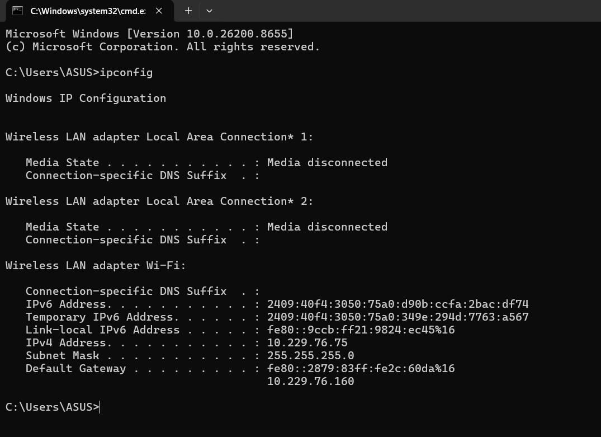
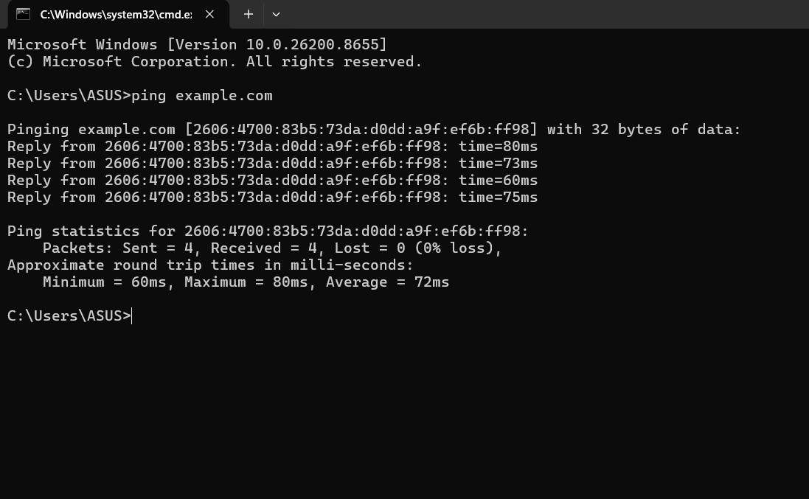
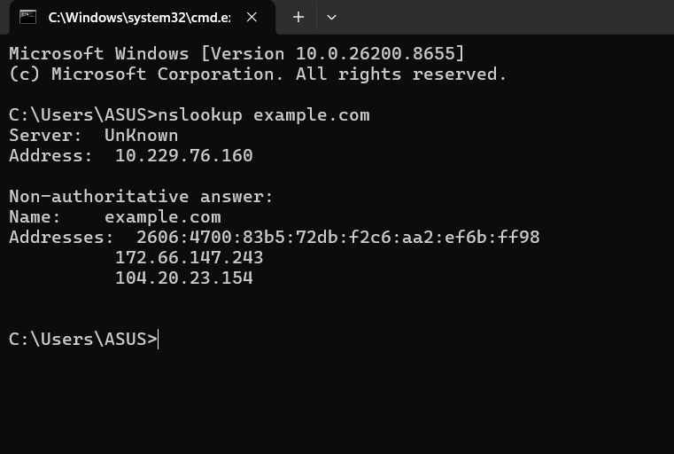
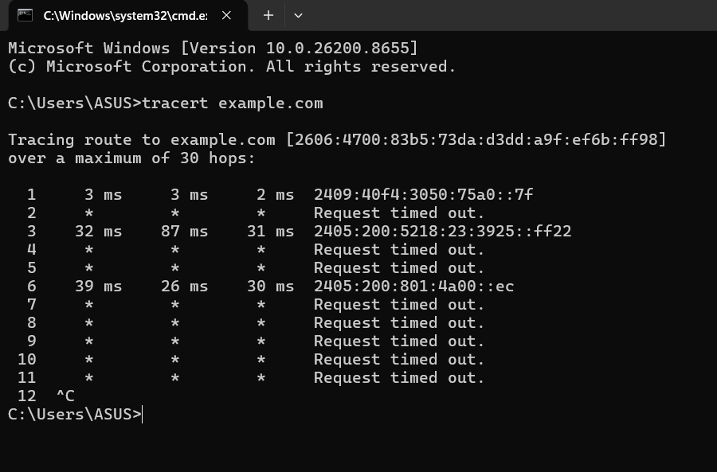
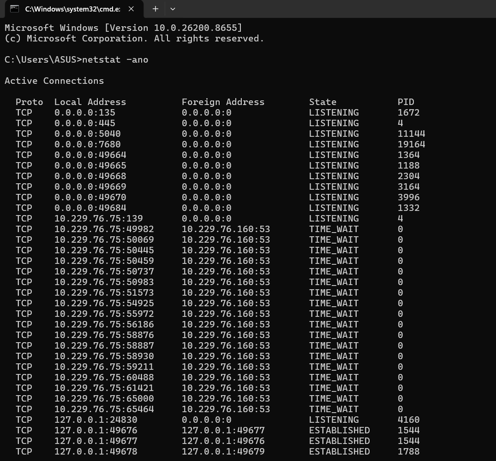

# Networking & Reconnaissance Report

## 1. Aim

To learn the fundamentals of networking and perform basic reconnaissance using command-line tools.

## 2. Tools Used

* Windows Command Prompt
* Networking commands
* GitHub

## 3. Basic Networking Concepts

### IP Address

An IP address uniquely identifies a device in a network.

### DNS

DNS translates domain names into IP addresses.

### Ports

Ports are used by applications and services for communication.

### Protocols

Protocols define how devices communicate over a network.

## 4. Commands Executed

### ipconfig

**Command:**

```bash
ipconfig
```

**Purpose:**
Displays local IP configuration details such as IPv4 address, subnet mask, and default gateway.

**Observation:**
The system displayed the current network configuration details.

**Screenshot:**


---

### ping example.com

**Command:**

```bash
ping example.com
```

**Purpose:**
Checks connectivity between the local system and the target domain.

**Observation:**
The target domain responded successfully, showing that the internet connection was active.

**Screenshot:**


---

### nslookup example.com

**Command:**

```bash
nslookup example.com
```

**Purpose:**
Retrieves DNS information of the target domain.

**Observation:**
The command resolved the domain name into its IP address.

**Screenshot:**


---

### tracert example.com

**Command:**

```bash
tracert example.com
```

**Purpose:**
Shows the path taken by packets to reach the destination.

**Observation:**
Multiple network hops were displayed between the local system and the target.

**Screenshot:**


---

### netstat -ano

**Command:**

```bash
netstat -ano
```

**Purpose:**
Displays active network connections and listening ports.

**Observation:**
The system displayed active connections and process IDs.

**Screenshot:**


## 5. Outcome

This task helped me understand important networking concepts such as IP addresses, DNS, ports, and protocols. It also introduced me to basic reconnaissance techniques using simple and safe commands.

